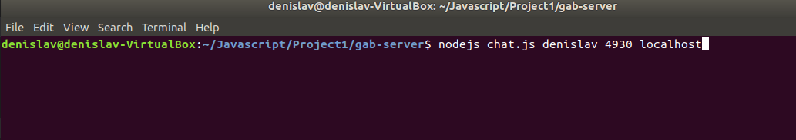
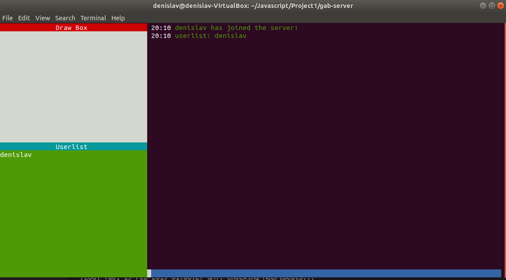
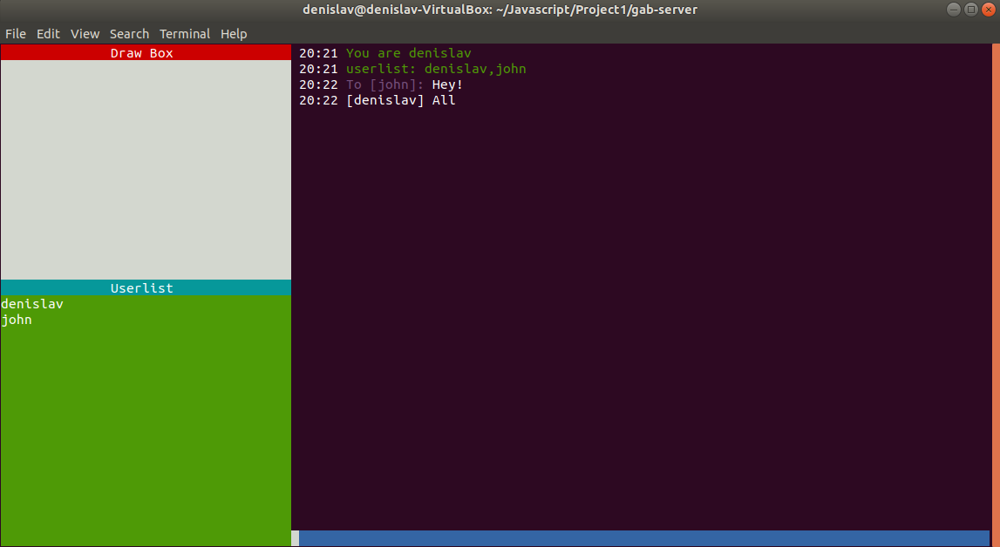
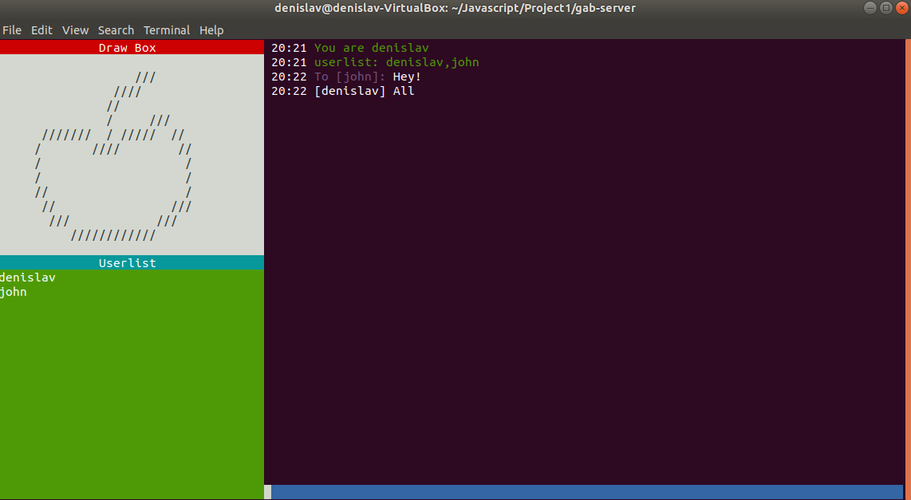
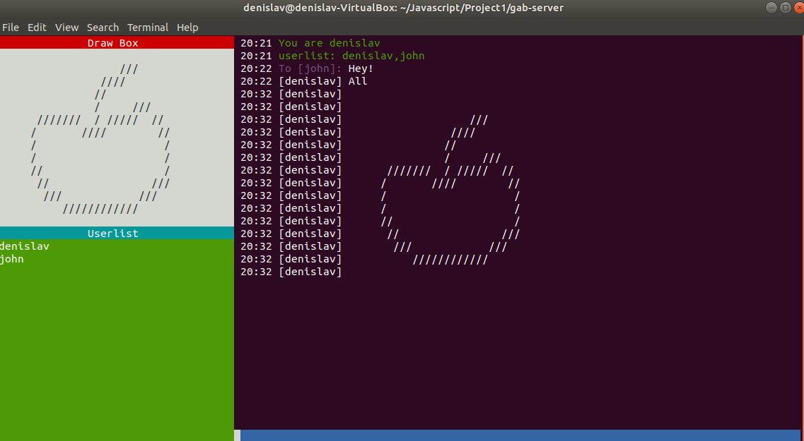
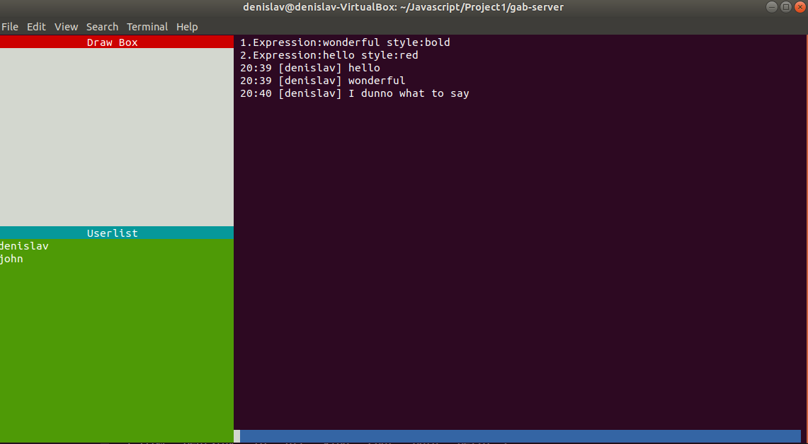
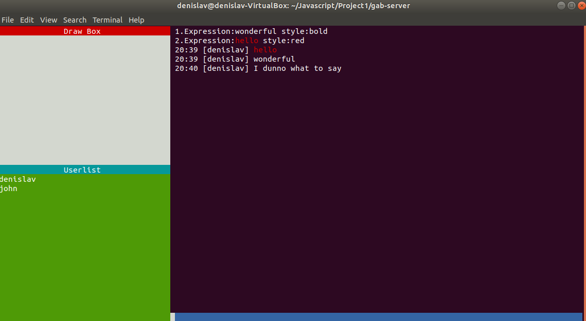

# GUI Chat terminal with Websockets

Chat client in the terminal with a GUI

## Getting Started

First, you must make sure that your terminal's environment supports 'xterm', so terminals on a Linux and Mac OS would work, however on **Windows** the command prompt or powershell **doesn't support** the environment so the project won't be able to run. Also, if you are on a **Linux**, instead of using node to run the javascript files, **use nodejs**.
Secondly, you must have a server to connect to, so you can connect to the server when you are in the directory by running `node .` ,thus initiating a local server on your computer with a port of '4930' and 'localhost'.

## Installing and Use

Start by typing the command `npm install` in the directory to install all of the dependencies needed in order to run this project, this will create all of the node modules needed.

Then to run the server locally, type the command `node .`,this will make it so that only you can connect to your server.

But to use a specific host/port number type the following command.

`node . [port] [host]`

Here is an example of a server running on port 4931 and address 10.226.9.220

`node . 4931 10.226.9.220`

Once you have the server running,you may connect to it with your chat client. The command to run it is:
`node chat.js \[username\] \[port\] \[host\]` as shown below, where 'denislav' is my username, '4930' is my port and 'localhost' is my host.

Also, when you have the terminal opened make sure that it's dimensions are both even number of pixels as this might result in cutting off of some of the elements. Once you have connected properly, the chat client will initialize in the terminal as shown below:

Here in the chat terminal you have a lot of commands and options to use.
There is a clear chat and clear drawing command both of which are:
`/clrchat` and `/clrdraw` , this will clear both of the boxes when prompted.

Furthermore, the standard commands are available for a chat terminal:  
`/whoami`- returns with what your username in the chat is  
`/userlist`- returns a userlist of all the people in the chat  
`/whis \[username\]` - you may direct message a user as long as the user exists in the client  
`/chat` - this messages the whole group in the chat  
Whenever you type a message it will automatically remember the last kind of message you sent and the person you sent it to, so if you direct messaged someone and started typing again without the command '/whis', then it will still send that message to the last person you direct messaged.  
These basic commands are shown down below:

  

### Additional features
The chat client also contains two boxes to the right as you can see. The green box with userlist above it, update whenever a user leaves or joins, it is a scrollable box that allows you to see all of the users currently on the server.
The second box allows drawing inside of it; this happens when you hover over the box and click on it once, then it will allow you to make ascii art with the '/' character and once you click on it again you stop drawing. As shown below:

  

We can then send this art piece in the chat with the `/senddraw` command which will send it to whoever you talked to last. 
  

Furthermore, the chat client allows you to format specific expressions on the screen; these expressions are taken from the 'expressions.json' file. In order to see which words and expression you may modify, use the command `/showexp` , this shows you the options from which to choose from:

 

Then you may choose which style and expression to choose from by using the command `/format \[number of the expression]\`, by doing the command '/format 2', I can see that all the words that are 'hello' turn red:

 

## Built With

* [ws](https://github.com/websockets/ws) - Simple to use, blazing fast and thoroughly tested WebSocket client and server for Node.js
* [blessed](https://github.com/chjj/blessed) - Easy GUI setup for the chat client
* [colors](https://github.com/marak/colors.js/) - Coloring and making the text easily readable

## Author
**Denislav Tsonev** 